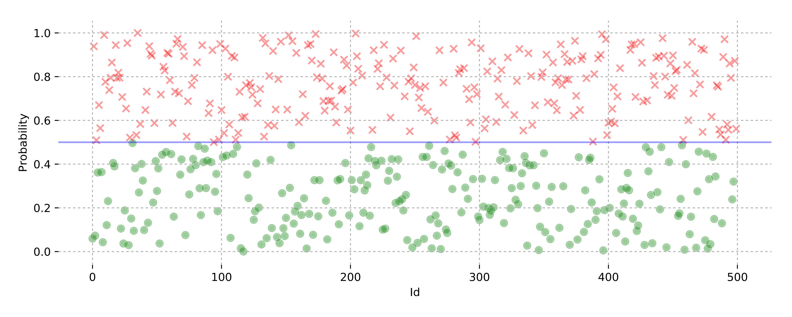
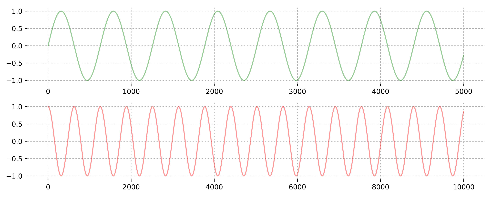

# PythonDataVizUtils
A collection of useful snippets for clean data visualizations (for reporting, publications, blog posts etc.) in Python with _matplotlib_

## Structure

Each visualization consists of:
- A Jupyter notebook to create the visualization with Python and matplotlib
- A .pdf render of the visualization

## Requirements

- **Python** (2 or 3)
- **Matplotlib** (for visualization), **Numpy** (to generate data)

## Examples

#### 2_Categories_Scatter_Plot.png

####  2_Subplots_Vertically_Stacked.png

